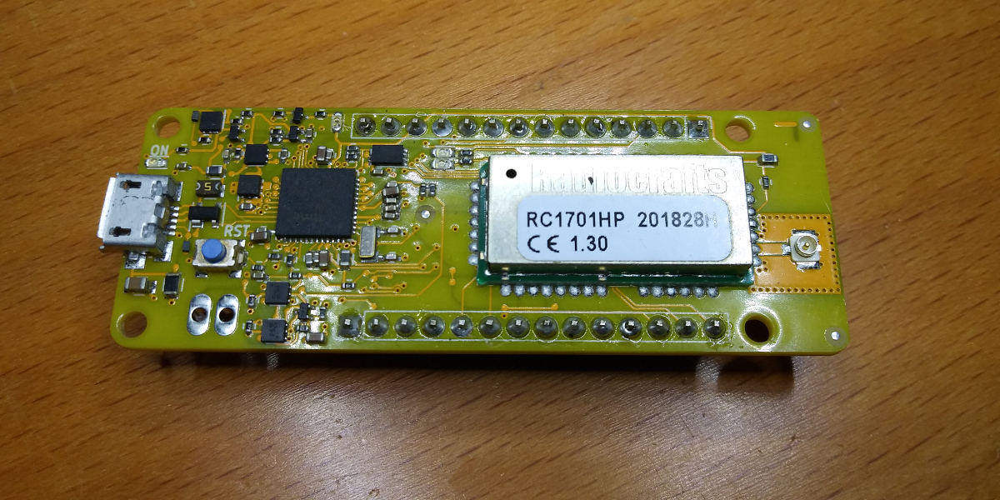

# AllWize K2

The AllWize K2 is an Arduino(TM) MKR compatible board based on the SAMD21G microchip and a RadioCrafts RC1701HP module.

Resources:

* [AllWize K2 Wiki Page](http://wiki.allwize.io/index.php?title=Allwize_K2)
* [AllWize Boards](https://github.com/AllWize/allwize-boards) to support the AllWize K2 board from the Arduino IDE and PlatformIO
* [AllWize Library](https://github.com/AllWize/allwize) that supports the RC1701HP radio module.

